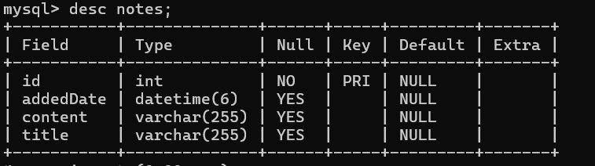

# Notetaker Application

## Project Overview
This is a Notetaker application built using Java, JSP, Servlets, and Hibernate. The application allows users to create, update, and delete notes (CRUD operations), which are stored in a MySQL database.

## Features
- Add new notes
- Edit existing notes
- Delete notes
- View all saved notes

## Technologies Used
- **Backend:** Java, JSP, Servlets
- **Database:** MySQL (`myhiber`)
- **ORM Framework:** Hibernate
- **Build Tool:** Maven
- **IDE:** Eclipse

## Database Schema
The project uses a MySQL database named `myhiber` with a `notes` table, structured as follows:

## Installation and Setup
1. Clone this repository to your local machine.
2. Open the project in Eclipse as a Maven Project.
3. Set up your MySQL database and create the schema with the name `myhiber`.
4. Update the database connection settings in `src/main/resources/hibernate.cfg.xml` to match your local MySQL setup.
5. Run `mvn clean install` to build the project.
6. Deploy the project to a server (Tomcat or another servlet container) and run it.